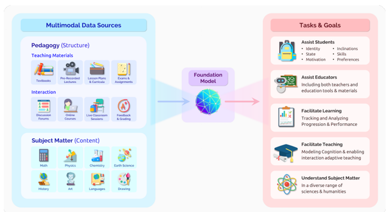
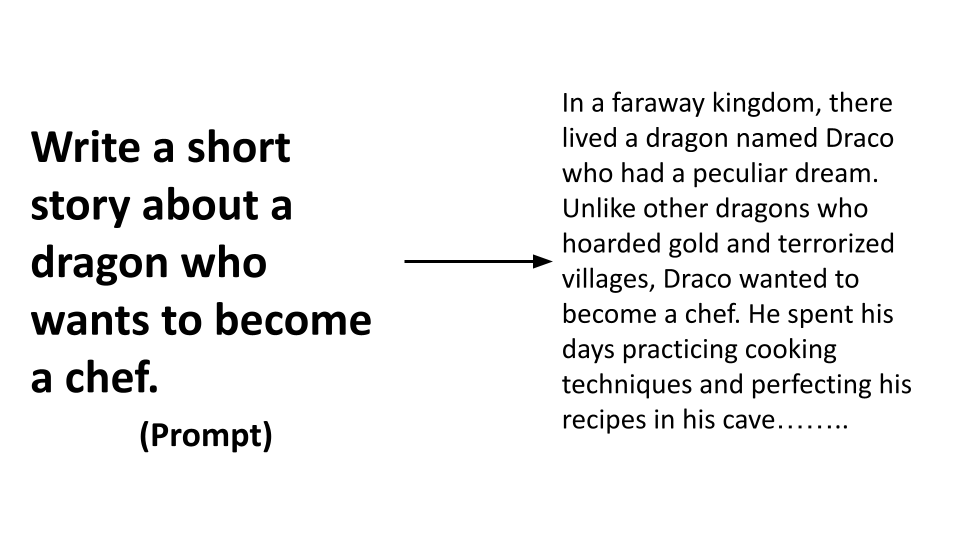

# Exploring and comparing different LLMs

With the previous lesson, we have seen how Generative AI is changing the technology landscape, how Large Language Models (LLMs) work. In this chapter, we're looking to compare and contrast different types of large language models (LLMs) to understand their pros and cons.

The next step in our journey is exploring the current landscape of LLMs and understanding which model is best suited for different use cases.

## Introduction

This lesson will cover:

- Understanding different types of LLMs.
- Foundation Models versus LLMs.
- Open Source versus Proprietary Models.
- Embedding versus Image generation versus Text and Code generation.
- Encoder-Decoder versus Decoder-only.

## Understand different types of LLMs

LLMs can have multiple categorizations based on their architecture, training data, and use case. Understanding these differences will help you select the right model for the scenario, and understand how to test, iterate, and improve performance.

There are many different types of LLM models, your choice of model depends on what you aim to use them for, your data, how much you're ready to pay and more.

Depending on if you aim to use the models for text, audio, video, image generation and so on, you might opt for a different type of model.

- **Text generation**. Most models are trained on text generation and you have a large variety of choices from GPT-3.5, GPT-4, Gemini, Claude and etc. They come at different costs with GPT-4 being the most expensive. It's worth looking into the [Azure OpenAI playground](https://oai.azure.com/portal/playground) or [Google AI Studio](https://aistudio.google.com/app/home) to evaluate which models best fit your needs in terms of capability and cost.

- **Image generation**. For image generation, DALL-E (Azure), Imagen (Google) and Midjourney are three very known choices. DALL-E is offered by Azure OpenAI. [Read more about DALL-E here](https://platform.openai.com/docs/models/dall-e), Imagen is offered by Google. [Read more about Imagen here](https://deepmind.google/technologies/imagen-2/), and Midjourney is a third party tool. [Read more about Midjourney here](https://midjourney.com/).

- **Multi-modality**. If you're looking to handle multiple types of data in input and output, you might want to look into models like [gpt-4 turbo with vision](https://learn.microsoft.com/azure/ai-services/openai/concepts/models#gpt-4-and-gpt-4-turbo-models) [Gemini](https://aistudio.google.com/app/home) These models are capable to combine natural language processing to visual understanding, enabling interactions through multi-modal interfaces.

Selecting a model means you get some basic capabilities, that might not be enough however. Often you have company specific data that you somehow need to tell the LLM about. There are a few different choices on how to approach that, more on that in the upcoming sections.

### Foundation Models versus LLMs

The term Foundation Model was [coined by Stanford researchers](https://arxiv.org/abs/2108.07258) and defined as an AI model that follows some criteria, such as:

- **They are trained using unsupervised learning or self-supervised learning**, meaning they are trained on unlabeled multi-modal data, and they do not require human annotation or labeling of data for their training process.
- **They are very large models**, based on very deep neural networks trained on billions of parameters.
- **They are normally intended to serve as a ‘foundation’ for other models**, meaning they can be used as a starting point for other models to be built on top of, which can be done by fine-tuning.

To further clarify this distinction, let’s take ChatGPT as an example. To build the first version of ChatGPT, a model called GPT-3.5 served as the foundation model. This means that OpenAI used some chat-specific data to create a tuned version of GPT-3.5 that was specialized in performing well in conversational scenarios, such as chatbots.

Image source: [2108.07258.pdf (arxiv.org)](https://arxiv.org/pdf/2108.07258.pdf)

### Open Source versus Proprietary Models

Another way to categorize LLMs is whether they are open source or proprietary.

Open-source models are models that are made available to the public and can be used by anyone. They are often made available by the company that created them, or by the research community. These models are allowed to be inspected, modified, and customized for the various use cases in LLMs. However, they are not always optimized for production use, and may not be as performant as proprietary models. Plus, funding for open-source models can be limited, and they may not be maintained long term or may not be updated with the latest research. Examples of popular open source models include [Gemma](https://ai.google.dev/gemma), [Alpaca](https://crfm.stanford.edu/2023/03/13/alpaca.html), [Bloom](https://sapling.ai/llm/bloom) and [LLaMA](https://sapling.ai/llm/llama).

Proprietary models are models that are owned by a company and are not made available to the public. These models are often optimized for production use. However, they are not allowed to be inspected, modified, or customized for different use cases. Plus, they are not always available for free, and may require a subscription or payment to use. Also, users do not have control over the data that is used to train the model, which means they should entrust the model owner with ensuring commitment to data privacy and responsible use of AI. Examples of popular proprietary models include [OpenAI models](https://platform.openai.com/docs/models/overview), [Google Bard](https://sapling.ai/llm/bard) or [Claude 2](https://www.anthropic.com/index/claude-2).

### Embedding versus Image generation versus Text and Code generation

LLMs can also be categorized by the output they generate.

Embeddings are a set of models that can convert text into a numerical form, called embedding, which is a numerical representation of the input text. Embeddings make it easier for machines to understand the relationships between words or sentences and can be consumed as inputs by other models, such as classification models, or clustering models that have better performance on numerical data. Embedding models are often used for transfer learning, where a model is built for a surrogate task for which there’s an abundance of data, and then the model weights (embeddings) are re-used for other downstream tasks. An example of this category is [OpenAI embeddings](https://platform.openai.com/docs/models/embeddings), [Google Embeddings](https://cloud.google.com/vertex-ai/generative-ai/docs/model-reference/text-embeddings)

Image generation models are models that generate images. These models are often used for image editing, image synthesis, and image translation. Image generation models are often trained on large datasets of images, such as [LAION-5B](https://laion.ai/blog/laion-5b/), and can be used to generate new images or to edit existing images with inpainting, super-resolution, and colorization techniques. Examples include [DALL-E-3](https://openai.com/dall-e-3) and [Stable Diffusion models](https://github.com/Stability-AI/StableDiffusion).

Text and code generation models are models that generate text or code. These models are often used for text summarization, translation, and question answering. Text generation models are often trained on large datasets of text, such as [BookCorpus](https://www.cv-foundation.org/openaccess/content_iccv_2015/html/Zhu_Aligning_Books_and_ICCV_2015_paper.html), and can be used to generate new text, or to answer questions. Code generation models, like [CodeParrot](https://huggingface.co/codeparrot), are often trained on large datasets of code, such as GitHub, and can be used to generate new code, or to fix bugs in existing code.

 

### Encoder-Decoder versus Decoder-only versus Encoder-only

Let's use a cooking analogy to explain the different types of architectures of Language Learning Models (LLMs).

Think of a Decoder-only model like a chef who specializes in creating new dishes. They have a pantry full of ingredients (the input data) and they can create a new dish (the output) based on what they have. However, they don't have a clear understanding of the individual ingredients or their relationships. They just know how to combine them to make something tasty. An example of a Decoder-only model is the GPT family of models, such as GPT-3.

An Encoder-only model, on the other hand, is like a food critic. They can taste a dish (the input) and understand its components and how they relate to each other, but they can't create a new dish themselves. They're good at understanding context and relationships, but not at generating content. An example of an Encoder-only model is BERT.

Finally, an Encoder-Decoder model is like a chef who is also a food critic. They can both create new dishes and understand the components of existing ones. They're good at both generating content and understanding context. Examples of Encoder-Decoder models include BART and T5.

## Fine-tuned model

Fine-tuning is a process that leverages transfer learning to ‘adapt’ the model to a downstream task or to solve a specific problem. It requires a set of training examples consisting of a single input (the prompt) and its associated output (the completion). Basically, fine-tuning is a way to make the model more exact and responsive to your needs. It’s like teaching the model to understand your specific use case and generate the completion you need. For example you are working on a chatbot for a financial institution, you can fine-tune a model on a dataset of financial conversations to make it more accurate and responsive to your needs.

## Improving LLM results

We’ve explored what different kinds of LLMs are available and how they can be used. But when shall they consider fine-tuning a model rather than using a pre-trained one? Are there other approaches to improve model performance on specific workloads?

There are several approaches one can use to get the results they need from an LLM, you can select different types of models with different degrees of training

deploy an LLM in production, with different levels of complexity, cost, and quality. Here are some different approaches:

- **Prompt engineering with context**. The idea is to provide enough context when you prompt to ensure you get the responses you need.

- **Retrieval Augmented Generation, RAG**. Your data might exist in a database or web endpoint for example, to ensure this data, or a subset of it, is included at the time of prompting, you can fetch the relevant data and make that part of the user's prompt.

- **Fine-tuned model**. Here, you trained the model further on your own data which leads to the model being more exact and responsive to your needs but might be costly.

### Prompt Engineering with Context

Pre-trained LLMs work very well on generalized natural language tasks, even by calling them with a short prompt, like a sentence to complete or a question – the so-called “zero-shot” learning.

However, the more the user can frame their query, with a detailed request and examples – the Context – the more accurate and closest to user’s expectations the answer will be. In this case, we talk about “one-shot” learning if the prompt includes only one example and “few shot learning” if it includes multiple examples.
Prompt engineering with context is the most cost-effective approach to kick-off with.

### Retrieval Augmented Generation (RAG)

LLMs have the limitation that they can use only the data that has been used during their training to generate an answer. This means that they don’t know anything about the facts that happened after their training process, and they cannot access non-public information (like company data).

This can be overcome through RAG, a technique that augments prompt with external data in the form of chunks of documents, considering prompt length limits. This method involves a two-step process: first, the model retrieves relevant documents from a database or web endpoint, and then it generates the completion based on the retrieved documents. Here we use Embedding models to retrieve the relevant documents and LLMs to generate the completion. 

### Fine-tuned model

Fine-tuning is a process that leverages transfer learning to ‘adapt’ the model to a downstream task or to solve a specific problem. Differently from few-shot learning and RAG, it results in a new model being generated, with updated weights and biases. It requires a set of training examples consisting of a single input (the prompt) and its associated output (the completion).
This would be the preferred approach if:

- **Using fine-tuned models**. A business would like to use fine-tuned less capable models (like embedding models) rather than high performance models, resulting in a more cost effective and fast solution.

- **Considering latency**. Latency is important for a specific use-case, so it’s not possible to use very long prompts or the number of examples that should be learned from the model doesn’t fit with the prompt length limit.

- **Staying up to date**. A business has a lot of high-quality data and ground truth labels and the resources required to maintain this data up to date over time.

### Trained model

Training an LLM from scratch is without a doubt the most difficult and the most complex approach to adopt, requiring massive amounts of data, skilled resources, and appropriate computational power. This option should be considered only in a scenario where a business has a domain-specific use case and a large amount of domain-centric data.

## Knowledge check

What could be a good approach to improve LLM completion results?

1. Prompt engineering with context
1. RAG
1. Fine-tuned model

A:3, if you have the time and resources and high quality data, fine-tuning is the better option to stay up to date. However, if you're looking at improving things and you're lacking time it's worth considering RAG first.

What are the different types of LLMs?

1. Embedding
1. Image generation
1. Text and code generation
1. All of the above

A:4, all of the above.

What is the difference between a foundation model and an LLM?

1. Foundation models are trained using unsupervised learning or self-supervised learning, while LLMs are trained using supervised learning.
1. Foundation models are very large models, while LLMs are smaller models.
1. Foundation models are intended to serve as a ‘foundation’ for other models, while LLMs are not.

A:3, Foundation models are intended to serve as a ‘foundation’ for other models, while LLMs are not.

What is the difference between open-source and proprietary models?

1. Open-source models are models that are made available to the public, while proprietary models are not.
1. Open-source models are often optimized for production use, while proprietary models are not.
1. Open-source models are not always available for free, while proprietary models are.

A:1, Open-source models are models that are made available to the public, while proprietary models are not.

## 🚀 Challenge

Read up more on my blog  [Understanding RAG](https://blog.miraclesoft.com/the-power-of-retrieval-augmented-generation-in-enhancing-generative-ai-capabilities/) for your use case.