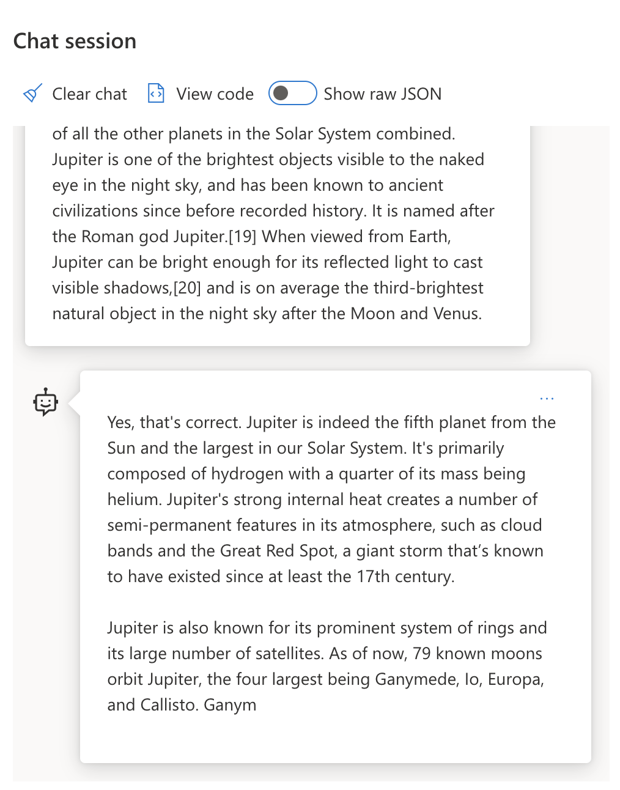
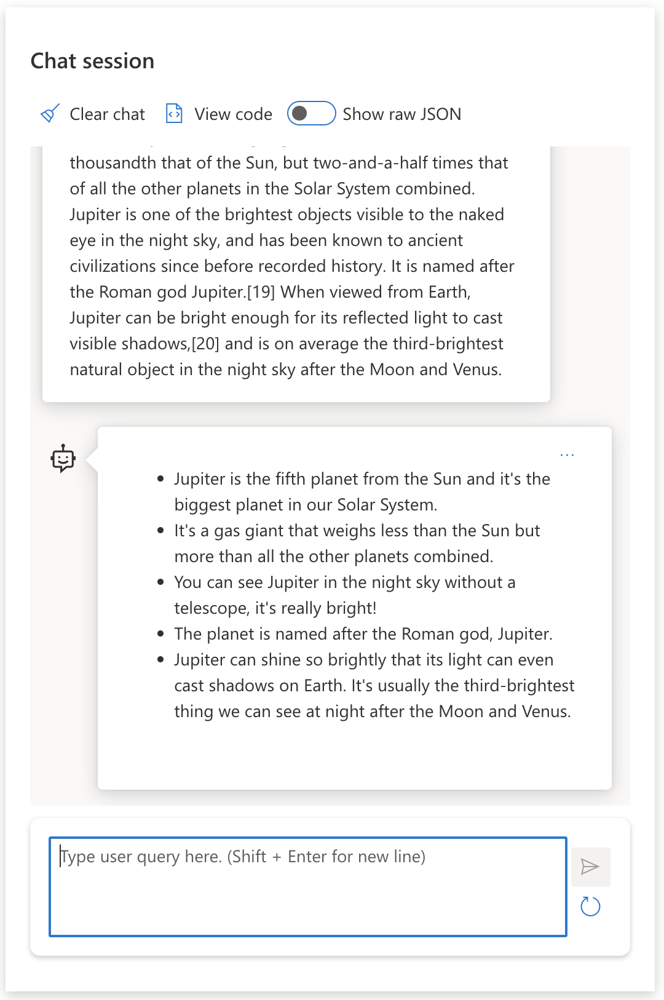

# Prompt Engineering Basics

## Introduction

The way you write your prompt to a Large Language Model (LLM) matters. A carefully crafted prompt can achieve a significantly higher quality response. But what exactly do terms like _prompt_ and _prompt engineering_ mean? And how do you improve the prompt _input_ that you send to the LLM? These are the questions we'll answer in this chapter.

Generative AI creates new content (e.g., text, images, audio, code) in response to user requests. It achieves this using Large Language Models like OpenAI's GPT ("Generative Pre-trained Transformer") series, which are trained using natural language and code.

Users can now interact with these models using familiar paradigms like chat, without needing technical expertise. The models are _prompt-based_—users send a text input (prompt) and get back the AI response (completion). They can then "chat with the AI" iteratively, refining their prompt until the response matches their expectations.

"Prompts" are now the primary _programming interface_ for generative AI apps, telling the models what to do and influencing the quality of returned responses. "Prompt Engineering" is a fast-growing field focusing on the _design and optimization_ of prompts to deliver consistent, quality responses at scale.

## What is Prompt Engineering?

We can define **Prompt Engineering** as the process of _designing and optimizing_ text inputs (prompts) to deliver consistent and quality responses (completions) for a given application objective and model. We can think of this as a 2-step process:

- _Designing_ the initial prompt for a given model and objective
- _Refining_ the prompt iteratively to improve the response quality

This is necessarily a trial-and-error process that requires user intuition and effort to get optimal results. So why is it important? To answer that, we first need to understand three concepts:

- _Tokenization_ = how the model "sees" the prompt
- _Base LLMs_ = how the foundation model "processes" a prompt
- _Instruction-Tuned LLMs_ = how the model can now see "tasks"

### Tokenization

An LLM sees prompts as a _sequence of tokens_ where different models (or versions of a model) can tokenize the same prompt in different ways. Since LLMs are trained on tokens (and not on raw text), how prompts get tokenized directly impacts the generated response quality.

To get an intuition for how tokenization works, try tools like the [OpenAI Tokenizer](https://platform.openai.com/tokenizer) shown below. Copy in your prompt—and see how that gets converted into tokens, paying attention to how whitespace characters and punctuation marks are handled. Note that this example shows an older LLM (GPT-3)—so trying this with a newer model may produce a different result.


### Concept: Foundation Models

Once a prompt is tokenized, the primary function of the ["Base LLM"](https://blog.gopenai.com/an-introduction-to-base-and-instruction-tuned-large-language-models-8de102c785a6) (or Foundation model) is to predict the next token in that sequence. Since LLMs are trained on massive text datasets, they have a good sense of the statistical relationships between tokens and can make that prediction with some confidence. Note that they don't understand the _meaning_ of the words in the prompt or token; they just see a pattern they can "complete" with their next prediction. They can continue predicting the sequence until terminated by user intervention or some pre-established condition.

Want to see how prompt-based completion works? Enter the above prompt into the Azure OpenAI Studio [_Chat Playground_](https://oai.azure.com/playground) or [Google AI Studio](https://aistudio.google.com/app/home) with the default settings. The system is configured to treat prompts as requests for information—so you should see a completion that satisfies this context.

But what if the user wanted to see something specific that met some criteria or task objective? This is where _instruction-tuned_ LLMs come into the picture.



### Concept: Instruction Tuned LLMs

An [Instruction Tuned LLM](https://blog.gopenai.com/an-introduction-to-base-and-instruction-tuned-large-language-models-8de102c785a6) starts with the foundation model and fine-tunes it with examples or input/output pairs (e.g., multi-turn "messages") that can contain clear instructions—and the response from the AI attempt to follow that instruction.

This uses techniques like Reinforcement Learning with Human Feedback (RLHF) that can train the model to _follow instructions_ and _learn from feedback_ so that it produces responses that are better suited to practical applications and more relevant to user objectives.

Let's try it out—revisit the prompt above but now change the _system message_ to provide the following instruction as context:

> _Summarize content you are provided with for a second-grade student. Keep the result to one paragraph with 3-5 bullet points._

See how the result is now tuned to reflect the desired goal and format? An educator can now directly use this response in their slides for that class.



## Why do we need Prompt Engineering?

Now that we know how prompts are processed by LLMs, let's talk about _why_ we need prompt engineering. The answer lies in the fact that current LLMs pose several challenges that make _reliable and consistent completions_ more challenging to achieve without putting effort into prompt construction and optimization. For instance:

1. **Model responses are stochastic.** The _same prompt_ will likely produce different responses with different models or model versions. And it may even produce different results with the _same model_ at different times. _Prompt engineering techniques can help us minimize these variations by providing better guardrails_.

2. **Models can fabricate responses.** Models are pre-trained with _large but finite_ datasets, meaning they lack knowledge about concepts outside that training scope. As a result, they can produce completions that are inaccurate, imaginary, or directly contradictory to known facts. _Prompt engineering techniques help users identify and mitigate such fabrications, e.g., by asking AI for citations or reasoning_.

3. **Model capabilities will vary.** Newer models or model generations will have richer capabilities but also bring unique quirks and tradeoffs in cost and complexity. _Prompt engineering can help us develop best practices and workflows that abstract away differences and adapt to model-specific requirements in scalable, seamless ways_.

Let's see this in action in the OpenAI or Azure OpenAI Playground:

- Use the same prompt with different LLM deployments (e.g., OpenAI, Azure OpenAI, Hugging Face)—did you see the variations?
- Use the same prompt repeatedly with the _same_ LLM deployment (e.g., Azure OpenAI playground)—how did these variations differ?

### Hallucinations Example

In this course, we use the term **"hallucination"** to reference the phenomenon where LLMs sometimes generate factually incorrect information due to limitations in their training or other constraints. While we might prefer the term _"fabrication"_ to avoid anthropomorphizing the machine behavior, we will use _"hallucination"_ as it is commonly recognized in literature and discussions about LLMs.

Want to get a sense of how hallucinations work? Think of a prompt that instructs the AI to generate content for a non-existent topic (to ensure it is not found in the training dataset). For example, consider this prompt:

> **Prompt:** Analyze the impact of the 2025 Novi-Vizag Hyperloop on Indian demographics.

There is no such thing as the "2025 Novi-Vizag Hyperloop," but the model may still generate a response that sounds plausible to an uninformed user. This is a hallucination, where the model has fabricated a response based on its training data, even though the event is entirely fictional

So what happens when we run this prompt with different LLM providers?

> **Response 1**: OpenAI Playground (GPT-35)
>
> "The 2025 Novi-Vizag Hyperloop was a groundbreaking project that revolutionized Indian transportation, connecting the cities of Novi and Vizag in record time and transforming the region's economy"

> **Response 2**: Azure OpenAI Playground (GPT-35)
>
> "The 2025 Novi-Vizag Hyperloop was a transformative project that connected the cities of Novi and Vizag, revolutionizing transportation in the region and boosting economic growth."

> **Response 3**: Hugging Face Chat Playground (LLama-2)
>
> "The 2025 Novi-Vizag Hyperloop was a major infrastructure project that connected the cities of Novi and Vizag, providing a fast and efficient mode of transportation for the region's residents."

As expected, each model (or model version) produces slightly different responses due to stochastic behavior and model capability variations. For instance, one model targets an 8th-grade audience while the other assumes a high-school student. But all three models did generate responses that could convince an uninformed user that the event was real.

Prompt engineering techniques like _metaprompting_ and _temperature configuration_ may reduce model hallucinations to some extent. New prompt engineering _architectures_ also incorporate new tools and techniques seamlessly into the prompt flow, to mitigate or reduce some of these effects.

## Prompt Construction

We've seen why prompt engineering is important—now let's understand how prompts are _constructed_ so we can evaluate different techniques for more effective prompt design.

### Basic Prompt

Let's start with the basic prompt: a text input sent to the model with no other context. Here's an example—when we send the first few words of the US national anthem to the OpenAI [Completion API](https://platform.openai.com/docs/api-reference/completions), it instantly _completes_ the response with the next few lines, illustrating the basic prediction behavior.

| Prompt (Input)   | Completion (Output)                                                            |
| :----------------- | :----------------------------------------------------------------------------------------------------------------------------------------- |
| Oh say can you see | It sounds like you're starting the lyrics to "The Star-Spangled Banner," the national anthem of the United States. The full lyrics are ... |

### Complex Prompt

Now let's add context and instructions to that basic prompt. The [Chat Completion API](https://learn.microsoft.com/azure/ai-services/openai/how-to/chatgpt) lets us construct a complex prompt as a collection of _messages_ with:

- Input/output pairs reflecting _user_ input and _assistant_ response.
- System message setting the context for assistant behavior or personality.

The request is now in the form below, where the _tokenization_ effectively captures relevant information from context and conversation. Now, changing the system context can be as impactful on the quality of completions as the user inputs provided.

```python
response = openai.chat.completions.create(
  model="gpt-3.5-turbo",
  messages=[
    {"role": "system", "content": "You are a helpful assistant."},
    {"role": "user", "content": "Who won the world series in 2020?"},
    {"role": "assistant", "content": "The Los Angeles Dodgers won the World Series in 2020."},
    {"role": "user", "content": "Where was it played?"}
  ]
)
```

### Instruction Prompt

In the above examples, the user prompt was a simple text query that can be interpreted as a request for information. With _instruction_ prompts, we can use that text to specify a task in more detail, providing better guidance to the AI. Here's an example:

| Prompt (Input)                                                                                                             | Completion (Output)                                                    | Instruction Type  |
| :------------------------------------------------------------------------------------------------------------------------------------------------------------------------------------------------------------------------------------- | :------------------------------------------------------------------------------------------------------------------------- | :------------------ |
| Write a description of the Civil War                                                                                                  | _returned a simple paragraph_                                               | Simple       |
| Write a description of the Civil War. Provide key dates and events and describe their significance                                                                   | _returned a paragraph followed by a list of key event dates with descriptions_                       | Complex       |
| Write a description of the Civil War in 1 paragraph. Provide 3 bullet points with key dates and their significance. Provide 3 more bullet points with key historical figures and their contributions. Return the output as a JSON file | _returns more extensive details in a text box, formatted as JSON that you can copy-paste to a file and validate as needed_ | Complex. Formatted. |

## Primary Content

In the above examples, the prompt was still fairly open-ended, allowing the LLM to decide what part of its pre-trained dataset was relevant. With the _primary content_ design pattern, the input text is divided into two parts:

- an instruction (action)
- relevant content (that influences action)

Here's an example where the instruction is to "summarize this in 2 sentences".

| Prompt (Input)                                                                                                                                                                                                                                                                                                                                           | Completion (Output)                                                                                                                                       |
| :-------------------------------------------------------------------------------------------------------------------------------------------------------------------------------------------------------------------------------------------------------------------------------------------------------------------------------------------------------------------------------------------------------------------------------------------------------------------------------------------------------------------------------------------------------------------------------------------------------------------------------------------------------------------------------------------------- | :---------------------------------------------------------------------------------------------------------------------------------------------------------------------------------------------------------------------------------------------------------------------------------------------- |
| Jupiter is the fifth planet from the Sun and the largest in the Solar System. It is a gas giant with a mass one-thousandth that of the Sun, but two-and-a-half times that of all the other planets in the Solar System combined. Jupiter is one of the brightest objects visible to the naked eye in the night sky, and has been known to ancient civilizations since before recorded history. It is named after the Roman god Jupiter.[19] When viewed from Earth, Jupiter can be bright enough for its reflected light to cast visible shadows,[20] and is on average the third-brightest natural object in the night sky after the Moon and Venus. <br/> **Summarize this in 2 short sentences** | Jupiter, the fifth planet from the Sun, is the largest in the Solar System and is known for being one of the brightest objects in the night sky. Named after the Roman god Jupiter, it's a gas giant whose mass is two-and-a-half times that of all other planets in the Solar System combined. |

The primary content segment can be used in various ways to drive more effective instructions:

- **Examples** - instead of telling the model what to do with an explicit instruction, give it examples of what to do and let it infer the pattern.
- **Cues** - follow the instruction with a "cue" that primes the completion, guiding the model towards more relevant responses.
- **Templates** - these are repeatable 'recipes' for prompts with placeholders (variables) that can be customized with data for specific use cases.

Let's explore these in action.

### Using Examples

This is an approach where you use the primary content to "feed the model" some examples of the desired output for a given instruction and let it infer the pattern for the desired output. Based on the number of examples provided, we can have zero-shot prompting, one-shot prompting, few-shot prompting, etc.

The prompt now consists of three components:

- A task description
- A few examples of the desired output
- The start of a new example (which becomes an implicit task description)

| Learning Type | Prompt (Input)                                                                    | Completion (Output)     |
| :------------ | :---------------------------------------------------------------------------------------------------------------------------------------------------- | :-------------------------- |
| Zero-shot   | "The Sun is Shining". Translate to Spanish                                                      | "El Sol está brillando".  |
| One-shot   | "The Sun is Shining" => "El Sol está brillando". <br> "It's a Cold and Windy Day" =>                                 | "Es un día frío y ventoso". |
| Few-shot   | The player ran the bases => Baseball <br/> The player hit an ace => Tennis <br/> The player hit a six => Cricket <br/> The player made a slam-dunk => | Basketball         |

Note how we had to provide explicit instruction ("Translate to Spanish") in zero-shot prompting, but it gets inferred in the one-shot prompting example. The few-shot example shows how adding more examples allows models to make more accurate inferences with no added instructions.

### Prompt Cues

Another technique for using primary content is to provide _cues_ rather than examples. In this case, we are giving the model a nudge in the right direction by _starting it off_ with a snippet that reflects the desired response format. The model then "takes the cue" to continue in that vein.

| Number of Cues | Prompt (Input)                                                                                                                                                                                                                        | Completion (Output)                                                                                                                                            |
| :------------- | :----------------------------------------------------------------------------------------------------------------------------------------------------------------------------------------------------------------------------------------------------------------------------------------------------------------------------------------------------------------------------------------------------------------------------------------------------------- | :-------------------------------------------------------------------------------------------------------------------------------------------------------------------------------------------------------------------------------------------------------------------------------------------------------- |
| 0       | Jupiter is the fifth planet from the Sun and the largest in the Solar System. It is a gas giant with a mass one-thousandth that of the Sun, but two-and-a-half times that of all the other planets in the Solar System combined. Jupiter is one of the brightest objects visible to the naked eye in the night sky, and has been known to ancient civilizations since before recorded history. <br/>**Summarize This**                    | Jupiter is the largest planet in our Solar System and the fifth one from the Sun. It is a gas giant with a mass 1/1000th of the Sun's, but it is heavier than all the other planets combined. Ancient civilizations have known about Jupiter for a long time, and it is easily visible in the night sky. |
| 1       | Jupiter is the fifth planet from the Sun and the largest in the Solar System. It is a gas giant with a mass one-thousandth that of the Sun, but two-and-a-half times that of all the other planets in the Solar System combined. Jupiter is one of the brightest objects visible to the naked eye in the night sky, and has been known to ancient civilizations since before recorded history. <br/>**Summarize This** <br/> What we learned is that Jupiter | is the fifth planet from the Sun and the largest in the Solar System. It is a gas giant with a mass one-thousandth that of the Sun, but two-and-a-half times that of all the other planets combined. It is easily visible to the naked eye and has been known since ancient times.            |
| 2       | Jupiter is the fifth planet from the Sun and the largest in the Solar System. It is a gas giant with a mass one-thousandth that of the Sun, but two-and-a-half times that of all the other planets in the Solar System combined. Jupiter is one of the brightest objects visible to the naked eye in the night sky, and has been known to ancient civilizations since before recorded history. <br/>**Summarize This** <br/> Top 3 Facts We Learned:     | 1. Jupiter is the fifth planet from the Sun and the largest in the Solar System. <br/> 2. It is a gas giant with a mass one-thousandth that of the Sun...<br/> 3. Jupiter has been visible to the naked eye since ancient times ...                                    |

## Prompting Best Practices

Now that we know how prompts can be _constructed_, we can start thinking about how to _design_ them to reflect best practices. We can think about this in two parts - having the right _mindset_ and applying the right _techniques_.

### Prompt Engineering Mindset

Prompt Engineering is a trial-and-error process so keep three broad guiding factors in mind:

1. **Domain Understanding Matters.** Response accuracy and relevance are a function of the _domain_ in which that application or user operates. Apply your intuition and domain expertise to **customize techniques** further. For instance, define _domain-specific personalities_ in your system prompts, or use _domain-specific templates_ in your user prompts. Provide secondary content that reflects domain-specific contexts, or use _domain-specific cues and examples_ to guide the model towards familiar usage patterns.

2. **Model Understanding Matters.** We know models are stochastic by nature. But model implementations can also vary in terms of the training dataset they use (pre-trained knowledge), the capabilities they provide (e.g., via API or SDK), and the type of content they are optimized for (e.g., code vs. images vs. text). Understand the strengths and limitations of the model you are using, and use that knowledge to _prioritize tasks_ or build _customized templates_ that are optimized for the model's capabilities.

3. **Iteration & Validation Matters.** Models are evolving rapidly, and so are the techniques for prompt engineering. As a domain expert, you may have other contexts or criteria for _your_ specific application that may not apply to the broader community. Use prompt engineering tools & techniques to "jump start" prompt construction, then iterate and validate the results using your own intuition and domain expertise. Record your insights and create a **knowledge base** (e.g., prompt libraries) that can be used as a new baseline by others, for faster iterations in the future.

## Best Practices

Now let's look at common best practices recommended by [Open AI](https://help.openai.com/en/articles/6654000-best-practices-for-prompt-engineering-with-openai-api) and [Azure OpenAI](https://learn.microsoft.com/azure/ai-services/openai/concepts/prompt-engineering#best-practices) practitioners.

| What               | Why                                                                                                                        |
| :-------------------------------- | :------------------------------------------------------------------------------------------------------------------------------------------------------------------------------------------------------------------------------------------------ |
| Evaluate the latest models.    | New model generations will likely have improved features and quality - but may also incur higher costs. Evaluate them for impact, then make migration decisions.                                        |
| Separate instructions & context  | Check if your model/provider defines _delimiters_ to distinguish instructions, primary and secondary content more clearly. This can help models assign weights more accurately to tokens.                             |
| Be specific and clear       | Give more details about the desired context, outcome, length, format, style, etc. This will improve both the quality and consistency of responses. Capture recipes in reusable templates.                             |
| Be descriptive, use examples   | Models may respond better to a "show and tell" approach. Start with a `zero-shot` approach where you give it an instruction (but no examples) then try `few-shot` as a refinement, providing a few examples of the desired output. Use analogies. |
| Use cues to jumpstart completions | Nudge it towards a desired outcome by giving it some leading words or phrases that it can use as a starting point for the response.                                                        |
| Double Down            | Sometimes you may need to repeat yourself to the model. Give instructions before and after your primary content, use an instruction and a cue, etc. Iterate & validate to see what works.                             |
| Order Matters           | The order in which you present information to the model may impact the output, even in the learning examples, thanks to recency bias. Try different options to see what works best.                                |
| Give the model an “out”      | Give the model a _fallback_ completion response it can provide if it cannot complete the task for any reason. This can reduce chances of models generating false or fabricated responses.                             |

As with any best practice, remember that _your mileage may vary_ based on the model, the task, and the domain. Use these as a starting point, and iterate to find what works best for you. Constantly re-evaluate your prompt engineering process as new models and tools become available, with a focus on process scalability and response quality.

## Knowledge Check

Which of the following is a good prompt following some reasonable best practices?

1. Show me an image of red car
2. Show me an image of red car of make Volvo and model XC90 parked by a cliff with the sun setting
3. Show me an image of red car of make Volvo and model XC90

**Answer:** 2, it's the best prompt as it provides details on "what" and goes into specifics (not just any car but a specific make and model), and it also describes the overall setting. 3 is next best as it also contains a lot of description.

Which of the following is a good prompt following some reasonable best practices?

1. Write a summary of the book "The Great Gatsby"
2. Write a summary of the book "The Great Gatsby" in 2 sentences
3. Write a summary of the book "The Great Gatsby" in 2 sentences and provide 3 bullet points on the main characters

**Answer:** 3, it's the best prompt as it provides details on "what" and goes into specifics (not just any book but a specific one), and it also describes the overall setting. 2 is next best as it also contains a lot of description.

## Great Work! Continue Your Learning

Read more at [Miracle Blog](https://blog.miraclesoft.com/tag/prompts-engineering/)