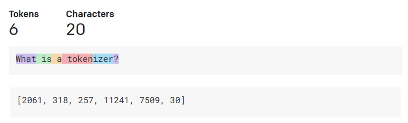

# Introduction to Generative AI and Large Language Models

Generative AI is a type of artificial intelligence that can create new content, such as text, images, and more. It's like having a tool that can write essays, generate images, or even create music based on simple instructions you give it. This technology is powerful because it makes sophisticated AI tools accessible to everyone; you don't need to be a programmer to use it.

In this guide, we'll explore how generative AI is shaping the way we think about and interact with technology.

## What is Generative AI?

Generative AI refers to AI systems that can generate new content. It's a shift from traditional AI that could only analyze data and provide outputs based on specific programming. Now, AI can take a simple prompt from you and generate a creative response.

## How Did We Get to Generative AI?

The journey to today's AI capabilities started decades ago:

- **Early AI and Chatbots:** Initially, AI was simple and could only respond based on pre-programmed answers.
- **Machine Learning:** In the 1990s, AI evolved to learn from data, identifying patterns and making decisions.
- **Neural Networks:** With better hardware, AI research expanded, leading to more sophisticated models that could process and understand language better.

We're now at a point with AI having human cognitive capabilities, like conversation as shown by for example [OpenAI ChatGPT](https://chatgpt.com/), [Google Gemini](https://gemini.google.com/app), [Copilot Chat](https://www.bing.com/chat) and [Hugging Chat](https://huggingface.co/chat/)

### The Rise of Large Language Models

Recently, a new type of AI model called the Transformer has made significant improvements in how machines understand and generate language. These models, known as Large Language Models (LLMs), are trained on vast amounts of text and can perform various language tasks.

)

## How Do Large Language Models Work?

Let's simplify how these advanced models process language:

- **Tokenization:** LLMs convert text into numerical values called tokens because machines understand numbers better than text.
  
  

- **Generating Responses:** The model predicts the next part of the text based on the input it receives, which allows it to generate complete paragraphs.

- **Choosing the Right Words:** The model calculates which words (or tokens) are most likely to come next, adding a bit of randomness to make the responses seem more natural and less repetitive.

## Practical Uses of Large Language Models

Here are a few ways these models can be helpful:

- **Writing Assistance:** They can help you write essays, emails, or even code by providing suggestions on how to complete your sentences.
  
  

- **Answering Questions:** You can ask these models questions about almost anything, and they'll provide answers based on the information they've been trained on.
  
  

- **Content Creation:** They are great for generating creative content, like stories or marketing copy.
  
  

## Limitations of Large Language Models

While LLMs are powerful, they're not perfect:

1. **They're not intelligent:** They don't understand the world or have emotions; they process information based on patterns in data.
2. **Responses can be unpredictable:** Since they add randomness to their responses, you might get different answers each time you ask the same question.

## Conclusion

Generative AI is transforming how we interact with technology, making it more accessible and capable. As these tools evolve, they'll continue to open up new possibilities for creativity and efficiency.

## Knowledge Check

1. **True or False:** You always get the same response from a large language model.
    - **Answer:** False. The responses can vary because of the randomness in the model's design.

2. **What is a 'prompt' in the context of generative AI?**
    - **Answer:** A prompt is the input you give to an AI model to generate a response. It's like asking a question or giving a command.

3. **What is tokenization, and why is it important in large language models?**
    - **Answer:** Tokenization is the process of converting text into numerical values. It's essential because machines understand numbers better than text.

4. **What are some practical uses of large language models?**
    - **Answer:** Large language models can help with writing, answering questions, and content creation.

5. **What are some limitations of large language models?**
    - **Answer:** They're not intelligent and can give unpredictable responses.

By understanding these basics, you can start exploring the potential of generative AI in various fields!
